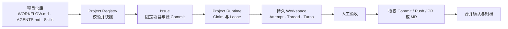

# Symphony Control Plane

面向 Windows 本地开发环境的 Agent 调度与交付控制面。它以 `Issue` 为唯一调度单位，以项目仓库中的 `WORKFLOW.md`、`AGENTS.md` 和 `.codex/skills` 为执行契约，通过 FastAPI、SQLite 与 Codex App Server 让一个 Coding Agent 在持久上下文中完成分析、实现和验证。

> 当前项目为 Windows-first 实现，适合本地开发、流程验证和小规模多项目调度；数据层目前仅支持 SQLite。

## 核心能力

- **仓库驱动**：每个项目自行维护 Workflow、开发规则与 Skills，控制面只负责登记、快照和调度。
- **完整 Issue 生命周期**：覆盖 `ready`、执行、人工输入、重试、评审、交付、归档与取消。
- **持久执行上下文**：一个 Issue 绑定一个 Workspace、Attempt、Thread，并允许在同一 Thread 中连续执行多个 Turn。
- **多项目隔离**：每个启用项目拥有独立 Runtime，只领取属于自己的 Issue。
- **人工交付门禁**：Agent 不能自行 Push、创建 PR/MR、合并或发布；每一步都需要明确授权。
- **可观测性**：UI 和 API 提供 Runtime、Turn、事件、产物、变更摘要和人工决策记录。
- **安全的 Workspace 管理**：固定源 Commit、验证 Git 根目录、隔离 Agent 资产，并支持完成后的 Workspace 归档。

## 工作方式



系统中的主要组件：

| 组件 | 职责 |
| --- | --- |
| Control Plane | FastAPI 服务，保存 Project、Issue、Claim/Lease、Attempt/Turn、Event、Artifact 与交付状态 |
| Windows Symphony Runner | 按项目轮询 `ready` Issue，维护 Workspace，并驱动 Codex App Server 多 Turn 执行 |
| Codex App Server | 在项目规则和仓库级 Skills 约束下完成编码任务 |
| Web UI | 登记项目、创建 Issue、查看 Agent 状态、处理人工决策与交付门禁 |
| SQLite | 持久化控制面状态；WAL 模式运行，数据库文件默认位于 `data/` |

## 环境要求

- Windows 10/11 或 Windows Server
- Python 3.11+
- Git
- 可执行的 `codex app-server`
- GitHub 交付需要 [GitHub CLI](https://cli.github.com/)；GitLab API 交付需要具备 `api` Scope 的 Token

## 快速开始

### 1. 获取代码并创建虚拟环境

```powershell
git clone https://github.com/RR9-cn/symphony-control-plane.git
Set-Location symphony-control-plane

python -m venv .venv
.\.venv\Scripts\Activate.ps1
python -m pip install --upgrade pip
python -m pip install -r requirements-dev.txt
```

### 2. 准备配置与数据库

```powershell
Copy-Item .env.example .env
python -m alembic upgrade head
```

编辑 `.env`，至少把示例中的 `ACP_API_TOKEN` 替换为随机的本机专用 Token。不要提交 `.env`；它已被 `.gitignore` 排除。

### 3. 启动控制面

```powershell
python -m uvicorn control_plane.app:app --app-dir src --host 127.0.0.1 --port 8080
```

启动后可访问：

- Web UI：<http://127.0.0.1:8080/>
- 健康检查：<http://127.0.0.1:8080/health>
- OpenAPI：<http://127.0.0.1:8080/docs>

若配置了 `ACP_API_TOKEN`，API 请求需要 Bearer Token；UI 只在当前标签页的 `sessionStorage` 中保存输入的 Token。

## 登记并运行项目

1. 在 UI 中登记一个本机 Git 仓库的绝对路径。
2. 系统校验该仓库的 HEAD、默认分支、`WORKFLOW.md`、`AGENTS.md` 和仓库级 Skills。
3. 校验通过后创建属于该项目的 Issue；Issue 进入 `ready` 时会固定当前源 Commit。
4. 启动项目 Runtime，Runner 将创建独立 Workspace 并驱动 Agent 执行。
5. Agent 完成后进入一次最终人工验收，再由人工授权本地 Commit、Push 和 PR/MR。

目标项目仓库建议包含：

```text
your-project/
├── WORKFLOW.md       # 调度、Workspace Hook、Codex 参数与任务 Prompt
├── AGENTS.md         # 开发规则、安全边界与验证要求
├── .codex/skills/    # 可选的仓库级 Skills
└── ...               # 业务代码
```

如果目标仓库缺少 `WORKFLOW.md`，控制面可写入内置模板，但不会替你修改 Git 历史。请检查并提交模板后重新校验项目。

也可以手工启动单个项目 Runner：

```powershell
$env:CONTROL_PLANE_TOKEN = "<与 ACP_API_TOKEN 相同的值>"
$env:SYMPHONY_PROJECT_ID = "<project-uuid>"
$env:SYMPHONY_PROJECT_REPOSITORY = "D:\path\to\project"
$env:SYMPHONY_PROJECT_DEFAULT_BRANCH = "master"

symphony-control-plane-runner D:\path\to\project\WORKFLOW.md
```

使用 `--once` 可只轮询一次并等待当前批次结束：

```powershell
symphony-control-plane-runner .\WORKFLOW.md --once --log-level INFO
```

## 配置

应用通过 `.env` 或系统环境变量读取配置。常用选项如下：

| 环境变量 | 默认值 | 说明 |
| --- | --- | --- |
| `ACP_DATABASE_URL` | `sqlite+aiosqlite:///./data/control-plane.db` | SQLite 数据库 URL |
| `ACP_API_TOKEN` | 空 | 控制面 Bearer Token；公开监听时必须配置 |
| `ACP_SQL_ECHO` | `false` | 是否输出 SQLAlchemy SQL 日志 |
| `ACP_LEASE_SWEEP_INTERVAL_SECONDS` | `5` | 过期 Lease 扫描间隔 |
| `ACP_DEFAULT_RETRY_DELAY_SECONDS` | `5` | 默认重试延迟 |
| `ACP_WORKER_OFFLINE_AFTER_SECONDS` | `20` | Worker 判定离线的时间窗口 |
| `ACP_ISSUE_WORKSPACE_ROOT` | `.workspaces` | Issue Workspace 根目录 |
| `ACP_MANAGED_RUNNER_AUTOSTART` | `false` | 服务启动时是否自动启动托管 Runner |
| `ACP_MANAGED_RUNNER_WORKFLOW` | `WORKFLOW.md` | 托管 Runner 使用的 Workflow |
| `ACP_GITLAB_TOKEN` | 空 | GitLab API Token；GitHub 交付使用已登录的 `gh` |

完整示例见 [`.env.example`](.env.example)，Workflow 参数见 [`WORKFLOW.md`](WORKFLOW.md)。

## 安全与交付边界

- 默认仅监听 `127.0.0.1`；若需要暴露到其他网络，请启用 `ACP_API_TOKEN` 并在可信反向代理后运行。
- `.env`、SQLite 数据、Workspace、缓存和构建产物不会进入 Git。
- Issue 绑定不可变的源 Commit；目标分支前进后必须继续 Issue、集成新版本并重新验证。
- Agent 无权调用交付 API，也不能自行 Push、创建 PR/MR、合并或发布。
- GitHub 交付通过 `git` 与 `gh` 完成；GitLab 支持 API Token 或 Git Push Options。

## 开发与验证

```powershell
python scripts/validate_protocol.py
python scripts/validate_workflow.py .\WORKFLOW.md
python scripts/validate_skills.py
python -m pytest -q
```

当前测试覆盖协议状态机、项目仓库绑定、Control Plane API、Runner 编排、Workspace、交付门禁和运行时一致性。

## 项目结构

```text
src/control_plane/       FastAPI、领域服务、数据库、交付逻辑与 UI
src/symphony_windows/    Windows Runner、Workflow、Workspace 与 Codex 客户端
migrations/              Alembic 数据库迁移
protocol/                Issue 协议、状态机与 JSON Schema
skills/                  可随项目分发的示例 Skills
tests/                   单元、集成与一致性测试
docs/                    设计、后端协议与 Runner 文档
```

## 进一步阅读

- [项目仓库驱动方案](docs/v2-project-repository-workflow.md)
- [实施方案](docs/implementation-plan.md)
- [Control Plane 后端](docs/backend.md)
- [Windows Runner](docs/windows-runner.md)
- [Issue Protocol](protocol/README.md)

## 项目状态

项目仍在快速演进中，接口、数据库迁移和 Workflow 约定可能发生不兼容变化。用于重要仓库前，请先在隔离环境中验证完整的 Issue 与交付流程。
