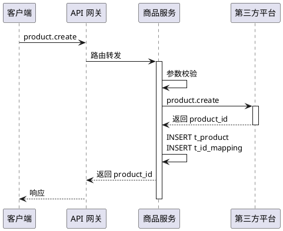
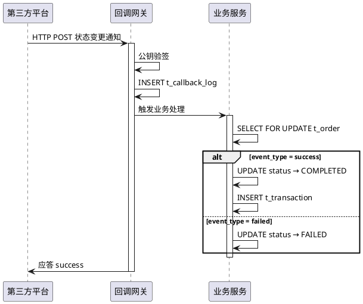
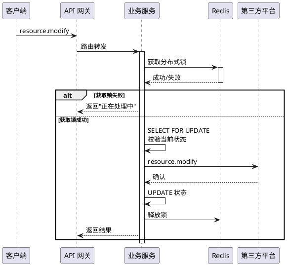

# 步骤卡片（Step Card）参考

步骤卡片是技术分析文档中核心流程的组成部分，用于详细描述每个业务流程中的技术实现细节。
每个核心流程 = **PlantUML 时序图** + **步骤卡片**。

## 步骤卡片格式

### 基本结构

每个步骤一段，线性排列，使用内联标签标注操作类型：

```markdown
**Step {{N}} · {{步骤名称}}**
- `校验` {{校验条件}}
- `调外部` {{外部接口名}}
- `INSERT` **{{表名}}**
  - {{字段列表}}
- `UPDATE` **{{表名}}** SET {{字段=值}}
- `事务` {{事务边界说明}}
- `锁` {{锁类型}}
- `幂等` {{幂等策略}}
```

### 关键规则

1. **校验步骤必须展开通过/不通过两条路径**

```markdown
| 校验项 | 通过 | 不通过 |
|--------|------|--------|
| {{条件}} | 继续 | 返回错误：`{{错误码}}`，{{原因}} |
```

2. **数据写入步骤必须展开到字段级别**

```markdown
- `INSERT` **{{表名}}**

| 字段 | 值 | 说明 |
|------|---|------|
| {{字段名}} | {{值}} | {{说明}} |
```

3. **外部调用必须标注成功/失败两条路径**

```markdown
- `调外部` {{接口名}}

| 结果 | 处理 |
|------|------|
| 成功 | {{成功处理}} |
| 失败 | 返回错误：`{{错误码}}`，{{失败处理}} |
```

4. **事务异常必须标注回滚策略**

```markdown
> 事务异常：{{回滚策略说明}}
```

5. **有分支的流程按分支分别列出步骤卡片**

### 标签说明

| 标签 | 用途 | 示例 |
|------|------|------|
| `校验` | 参数校验、业务规则校验 | `校验` product_id 存在且 status=1 |
| `调外部` | 调用第三方 API 或外部服务 | `调外部` payment.create |
| `INSERT` | 数据库插入操作 | `INSERT` **t_order** |
| `UPDATE` | 数据库更新操作 | `UPDATE` **t_order** SET status=ACTIVE |
| `事务` | 标注事务边界 | `事务` 订单+订单项同事务 |
| `锁` | 并发控制 | `锁` SELECT FOR UPDATE |
| `幂等` | 幂等策略 | `幂等` order_no 唯一索引 |

## 分支流程格式

当流程有多个分支时（如按事件类型路由），使用以下格式：

```markdown
#### 公共前置步骤

**Step 1 · {{公共步骤名}}**
{{步骤卡片}}

#### 分支 A · {{分支名称}}

**Step N · {{步骤名称}}**
{{步骤卡片}}

#### 分支 B · {{分支名称}}

**Step N · {{步骤名称}}**
{{步骤卡片}}
```

## 资金相关流程标注

涉及金额变动、余额流转、分账结算的环节，在步骤名称前加 ⚠️ 标记：

```markdown
**Step 4 · ⚠️ 写入退款记录** `事务: 通知+退款同事务`
```

## 完整示例

### 示例 1：标准 CRUD 流程



#### 操作步骤

**Step 1 · 参数校验**

| 校验项 | 通过 | 不通过 |
|--------|------|--------|
| name 非空且长度 [1,255] | 继续 | 返回错误：`INVALID_PARAM`，名称不合法 |
| category_id 存在且 status=1 | 继续 | 返回错误：`INVALID_CATEGORY`，分类不存在或已停用 |
| price > 0 | 继续 | 返回错误：`INVALID_PRICE`，价格必须大于 0 |

**Step 2 · 调用第三方创建接口**
- `调外部` third_party.product.create

| 结果 | 处理 |
|------|------|
| 成功 | 获取第三方侧 product_id，继续 |
| 失败 | 返回错误：`THIRD_PARTY_ERROR` + 原始错误码，**不写入本地数据**，流程终止 |

**Step 3 · 写入本地商品数据** `事务: 商品+映射，两表同事务`
- `INSERT` **t_product**

| 字段 | 值 | 说明 |
|------|---|------|
| product_id | 生成业务 ID | varchar(32) 业务主键 |
| tenant_code | 当前租户 | 来自网关鉴权 |
| name | 入参 name | 商品名称 |
| price | 入参 price | 单位：分 |
| status | 1 | 有效 |

**Step 4 · 写入 ID 映射** `同事务`
- `INSERT` **t_id_mapping**

| 字段 | 值 | 说明 |
|------|---|------|
| mapping_id | 生成业务 ID | varchar(32) 业务主键 |
| entity_type | product | 标识实体类型 |
| entity_id | Step 3 的 product_id | 本地侧 ID |
| third_party_id | Step 2 返回的 ID | 第三方侧 ID |

> 事务异常：Step 3/4 任一写入失败 → 整体回滚，返回 `INTERNAL_ERROR`。

**Step 5 · 返回**
- 返回 product_id

### 示例 2：回调通知流程（含分支）



#### 操作步骤

**公共前置步骤**

**Step 1 · 接收通知并验签**

| 校验项 | 通过 | 不通过 |
|--------|------|--------|
| 第三方公钥验签 | 继续 | 返回 HTTP 400，**不写入任何数据**，流程终止 |

- `INSERT` **t_callback_log**

| 字段 | 值 | 说明 |
|------|---|------|
| log_id | 生成业务 ID | varchar(32) 业务主键 |
| event_type | 通知中的 event_type | 事件类型 |
| process_status | 0 | 已接收，待处理 |
| raw_body | 原始 JSON | 保留完整报文 |

| 写入结果 | 处理 |
|----------|------|
| 成功 | 继续 |
| 唯一索引冲突（重复通知） | 记录日志，返回 HTTP 200，**跳过后续步骤**（幂等保护） |

**Step 2 · 锁定业务记录**
- `锁` SELECT FOR UPDATE t_order WHERE order_id=?

| 校验项 | 通过 | 不通过 |
|--------|------|--------|
| 订单记录存在 | 继续 | 记录异常日志，process_status 保持 0，等待重试 |

#### 分支 A · event_type = success（处理成功）

**Step 3 · 更新订单状态** `事务: 日志+订单+交易记录同事务`
- `UPDATE` **t_order** SET order_status = COMPLETED, completed_time = now()

**Step 4 · ⚠️ 写入交易记录** `同事务`
- `INSERT` **t_transaction**

| 字段 | 值 | 说明 |
|------|---|------|
| transaction_id | 生成业务 ID | varchar(32) 业务主键 |
| order_id | 当前 order_id | 关联订单表 |
| amount | 通知中的 amount | 单位：分 |
| transaction_type | PAYMENT | 支付类型 |

**Step 5 · 更新回调日志**
- `UPDATE` **t_callback_log** SET process_status = 1

#### 分支 B · event_type = failed（处理失败）

**Step 3 · 更新订单状态** `事务: 日志+订单同事务`
- `UPDATE` **t_order** SET order_status = FAILED, failed_time = now()

**Step 4 · 更新回调日志**
- `UPDATE` **t_callback_log** SET process_status = 1

### 示例 3：带分布式锁的修改流程



#### 操作步骤

**Step 1 · 获取分布式锁**

| 操作 | 通过 | 不通过 |
|------|------|--------|
| Redis 分布式锁 lock:resource:{resource_id} | 获取成功，继续 | 返回错误：`RESOURCE_BUSY`，资源正在处理中，请稍后 |

**Step 2 · 查询并锁定记录**
- `锁` SELECT FOR UPDATE t_resource WHERE resource_id=?

| 校验项 | 通过 | 不通过 |
|--------|------|--------|
| 记录存在 | 继续 | 释放锁，返回 `RESOURCE_NOT_FOUND` |
| status = ACTIVE（当前状态允许修改） | 继续 | 释放锁，返回 `INVALID_STATUS` |

**Step 3 · 调用第三方修改接口**
- `调外部` third_party.resource.modify

| 结果 | 处理 |
|------|------|
| 成功 | 继续 |
| 失败 | 释放锁，返回 `THIRD_PARTY_ERROR` |

**Step 4 · 更新本地状态**
- `UPDATE` **t_resource** SET status = MODIFIED, updated_time = now()
- 释放分布式锁

## 编写步骤卡片的注意事项

1. **细化到表字段级别**：每步 INSERT/UPDATE 都展开到具体字段、值、说明
2. **明确事务边界**：用 `事务:` 标签标注哪些操作在同一个事务内，用 blockquote 标注回滚策略
3. **标注锁机制**：用了什么锁，什么时候获取锁，什么时候释放锁
4. **标注幂等策略**：如何保证操作的幂等性（唯一索引等）
5. **校验和外部调用必须展开双路径**：通过/不通过、成功/失败都要说清楚
6. **资金相关加 ⚠️**：涉及金额变动的环节必须在步骤名称前加 ⚠️ 标记
7. **使用中文注释**：表名、字段名、状态枚举都必须有中文注释
8. **保持一致性**：同一张表的字段名称在全文中保持一致
